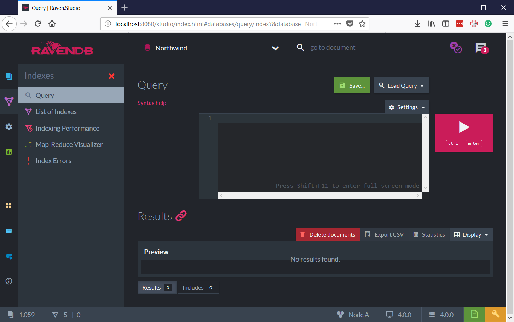

# Unit 1, Lesson 2 - Let's Query!

In the previous lesson, you learned how to install RavenDB on your computer,
create a database, and load sample data. You also learned some fundamental
concepts about document databases.

In this lesson you will learn how to write your own queries using RQL.

## What is RQL?

RQL is one of the most exciting features of RavenDB 4. It is a powerful and easy to
learn language that we designed to make your job easier.

From the Documentation:

> RQL, the Raven Query Language, is a SQL-like language used to retrieve the data
> from the server when queries are being executed. It is designed to expose the RavenDB
> query pipeline in a way that is easy to understand, easy to use, and not 
> overwhelming to the user.

The [RQL documentation](https://ravendb.net/docs/article-page/4.0/csharp/indexes/querying/what-is-rql)
is really good. Please consider reading it.


## Exercise: Getting Ready to Write Queries

It’s time to stop talking and to write some code. So, let’s do it!

1.  Open the `RavenDB Management Studio` (<http://localhost:8080> by default.)
2.  In the left panel, click on `Databases`
3.  Open the database we created in the previous lesson (Northwind, if you
    followed our recommendation)
4.  In the left panel, select the `Documents` section.
5.  Click on `Query`.



## Exercise: You First Query

Let’s start easy.

1.  Assuming you are already in the Query editor (inside the RavenDB Management
    Studio), type the following query.

```
from Employees
```
2.  Click on the `Run` button.

This query returns all the documents inside the `Employees` collection. 

Now, go ahead and try other queries like these. Get all the documents from the `Products` collection.

## Exercise: Filtering

Getting all documents from a collection is a nice thing but quite useless. Let’s make something more exciting.
  
```
from Employees
where FirstName == "Nancy"
```

FirstName is the name of one of the properties present in the documents from the Employees collection.

```json
{
    "LastName": "Davolio",
    "FirstName": "Nancy",
    "Title": "Sales Representative",
    "Address": {
        "Line1": "507 - 20th Ave. E.\r\nApt. 2A",
        "Line2": null,
        "City": "Seattle",
        "Region": "WA",
        "PostalCode": "98122",
        "Country": "USA",
        "Location": {
            "Latitude": 47.623473,
            "Longitude": -122.306009
        }
    },
    "HiredAt": "1992-05-01T00:00:00.0000000",
    "Birthday": "1948-12-08T00:00:00.0000000",
    "HomePhone": "(206) 555-9857",
    "Extension": "5467",
    "ReportsTo": "employees/2-A",
    "Notes": [
        "Education includes a BA in psychology from Colorado State University in 1970.",
        "She also completed \"The Art of the Cold Call\".",
        "Nancy is a member of Toastmasters International."
    ],
    "Territories": [
        "06897",
        "19713"
    ],
    "@metadata": {
        "@collection": "Employees",
        "@flags": "HasAttachments"
    }
}
```

## Exercise: Shaping the Query Result

Up to this point we are simply retrieving documents. Let’s say we want to shape what we get. Consider the following query.

```
from Orders
where Lines.Count > 4
select Lines[].ProductName as ProductNames, OrderedAt, ShipTo.City as City
```

Here, we are not interested in all data from the Orders documents. We are specifying a shape.

One of the results will look like:

```json
{
    "ProductNames": [
        "Ikura",
        "Gorgonzola Telino",
        "Geitost",
        "Boston Crab Meat",
        "Lakkalikööri"
    ],
    "OrderedAt": "1996-08-05T00:00:00.0000000",
    "ShipTo.City": "Cunewalde",
    "@metadata": {
        "@flags": "HasRevisions",
        "@id": "orders/26-A",
        "@last-modified": "2018-02-28T11:21:24.1689975Z",
        "@change-vector": "A:275-ZzT6GeIVUkewYXBKQ6vJ9g",
        "@projection": true,
        "@index-score": 1
    }
}
```

We will talk about the `metadata` in the future.

## Exercise: Using JavaScript in the query projections

Say you want to do more customization.

```
from Orders as o
load o.Company as c
select {
    Name: c.Name.toLowerCase(),
    Country: c.Address.Country,
    LinesCount: o.Lines.length
}
```
RavenDB allows you to use JavaScript when defining projections for the query results.

There is another interesting thing in this query, as you probably noted. The
Company field of an Order document contains the ID of another document stored in
the database. The load instruction is smart enough to get that document for you.
You can use it to project data as well.

## Exercise: Map and Reduce

Consider the following query:

```
from Orders
group by Company
where count() > 5
order by count() desc
select count() as Count, key() as Company
```

Here, we are grouping the Orders using the Company field as
grouping key. We are adding a filter to get only groups with five documents
at least, then, ordering these groups by the number of elements in descending
order. Finally, we are projecting the number of documents per group and the
group key.

This query results in a list of top buyers companies.

## How it Works

For a while, you shouldn’t care about our implementation details. But, it’s
important to say that we are concerned about performance and we use a bunch of
techniques to deliver results as fast as possible (even more!).

All queries in RavenDB are supported by a sophisticated and efficient indexing
mechanism. In simple words, we use indexes for all the queries. But, I will
explain it to greater detail in the future.

## Lesson 3

You have just completed the second lesson. Now you know the basics about Querying with RavenDB. 

**Let's move on to** [Lesson 3](../lesson3/README.md) **and start coding.**
