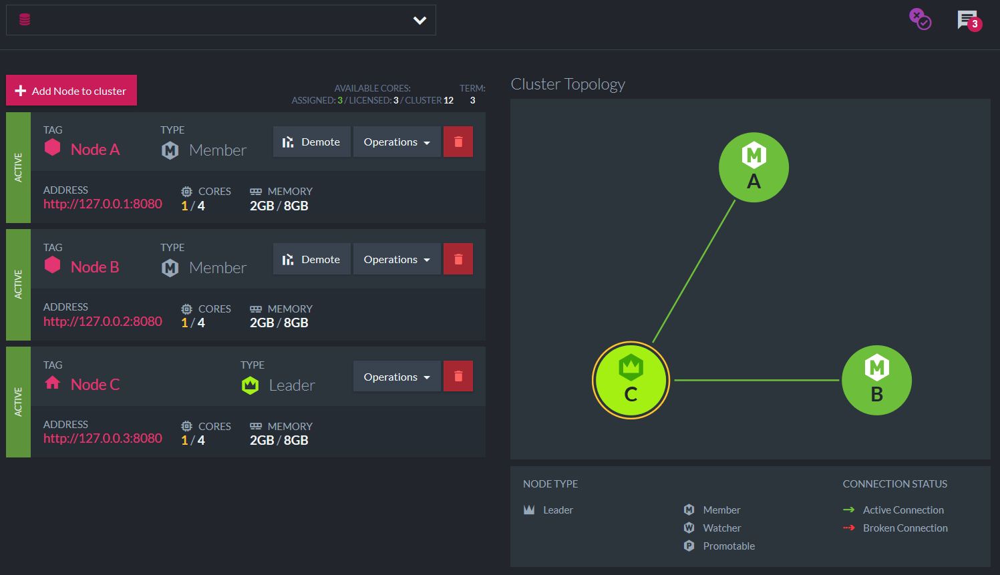
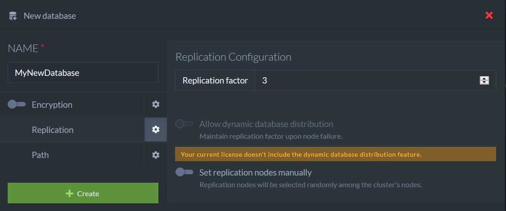

# Unit 4, Lesson 2 - Database and Database Group

Now that you already know how to set up a cluster, let's learn some in depth concepts about how it works. Let's also learn how to manage a database in the cluster.

## It's all about "Operations"

Operations in RavenDB can be classified into two categories:

1) Cluster-Wide Operations: They impact the entire cluster, like creating a new database.

2) Internal Database Operations: They impact a single database, like creating a new document.

This distinction is vital because cluster-wide operations demand consensus between the nodes of the cluster and it is only possible when the majority of the nodes is working.  RavenDB uses a consensus protocol called RAFT. To create a database in a cluster with three nodes, it would be necessary that at least two nodes are working (the majority). This is the reason why you should not have a cluster with only two nodes. When one is down, there is no majority.

> There are a lot of details about how the RAFT consensus protocol works in RavenDB that are beyond the scope of this bootcamp. If you want to understand it in-depth, I recommend you to read [Ayende's book](https://github.com/ravendb/book) (which is the definitive reference about RavenDB by the CEO, and it is free!).  

Database operations, on the other hand, are treated quite differently. Each node in the cluster has the full copy of the topology which specifies which nodes host which databases. The connection between the database instances does not use the consensus protocol. Instead of this, they're direct connections among the various nodes, and they form a multi-master mesh. A write to any of those nodes will be automatically replicated to all the other nodes.

Cluster Consensus provides firm consistency. Unfortunately, we also need to ensure availability of the databases, and it is a tradeoff (look for the [CAP theorem](https://en.wikipedia.org/wiki/CAP_theorem) to understand the reasons). We decided to provide consistency where it is indispensable and chose explicitly for availability elsewhere.

## Exploratory Challenge: What Happens when a Node Goes Down?

Assuming you are running a cluster with three nodes, this is the result you get when accessing the `Manage Server` screen on the `Management Studio`.

I recommend you stop some nodes now and see what happens in the diagram on the right side.

## Focus on Robustness

RavenDB's design is mainly focused on robustness. Once the cluster is set up, each database instance on the various nodes is independent. It can accept writes without consulting the other instances of the same database.

Even if the majority of the cluster is down, as long as a single node containing a database instance is available, RavenDB can process reads and writes. If a user is writing to the database, RavenDB will hold the data. 

## Creating a New Database with Replication

Whenever you create a new database you can specify a replication factor. That is the number of the cluster nodes that will contain an instance of the database.

It is important to remember that creating a database is a cluster-wide operation and requires a majority to work.

## Exploratory Challenge: Creating a Distributed Database

To practice, I would recommend you to create a new database setting the replication factor to two. I would recommend you to call it `MyDatabase`. (I am assuming that you are running the cluster we set up in the last lesson)

## Managing the Database Group

As you already know, the database group is the set of cluster nodes containing the instances of a database. 

You can manage the database group of a specified database accessing the `Databases` option in the left panel.

The image displays that the database we just created has instances on two nodes, Node C and Node A, but it can be different on your computer!

There is a status `Online` indicating that my database is active (meaning that I have an instance of this database running on this cluster node).  Accessing the same screen on the server that has no instance of my new database (in my example, Node B, which is running on `http://127.0.0.2:8080`), the status changes to `Remote`.

Clicking on the `Manage Group` button of the database that you want to manage allows you to change the nodes where there are instances of the selected database.

It is important to remember that managing a database group is a cluster-wide operation that requires a majority to work.

##  Exploratory Challenge: Managing the Database Group

Let's try to add a new cluster node to the Database Topology. After this, please, access the `Management Studio` of the corresponding node and see how amazing RavenDB is at replicating your data.

## Great Job! 

**Let's move onto [Lesson 3](../lesson3/README.md).**